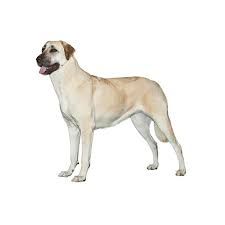

# Visual Question Answering
This is a python and keras implementation of the visual question answering model. Consider the paper [Exploring Models and Data for Image Question Answering](https://arxiv.org/abs/1505.02074).The model implemented is similar to the 2-VIS+BLSTM model from the paper mentioned above except that the LSTMs are not bidirectional.This model has two image feature inputs, at the start and the end of the sentence, with different learned linear transformations. We call it 2-VIS+LSTM. 

Details about the dataset are explained at the [VisualQA website](http://www.visualqa.org/). 

## Requirements

* Python 2.7
* Numpy
* Scipy (for loading pre-computed MS COCO features)
* NLTK (for tokenizer)
* Keras(version used: 2.0.9)

## Training

* The basic usage is `python train.py`. 

* The batch size and the number of epochs can also be specified using the options `-num_epochs` and `-batch_size`. The default batch size and number of epochs are 100 and 10 respectively.

* To train with a batch size of 200 for 20 epochs, we would use: `python train.py -batch_size=200 -num_epochs=20`.

* If your device gives memory error then make swap space of 40GB and rerun the code.

## Prediction

* Q&A can be performed on any image using the script `question_answer.py`.

* The options `-question` and `-image` are used to specify the question and address of the image respectively. 

* Run the script: `python question_answer.py -image="image path" -question="question text"`
  An example of usage is: `python question_answer.py -image="tree.jpg" -question="How many trees are there?"`

Here are some examples of predictions:

| Image                                              | Question                   | Top Answers (left to right) |
|----------------------------------------------------|----------------------------|-----------------------------|
|  					           | Which animal is this?      | dog, cat, giraffe           |
|  | Which vehicle is this?     | motorcycle, taxi, train     |
